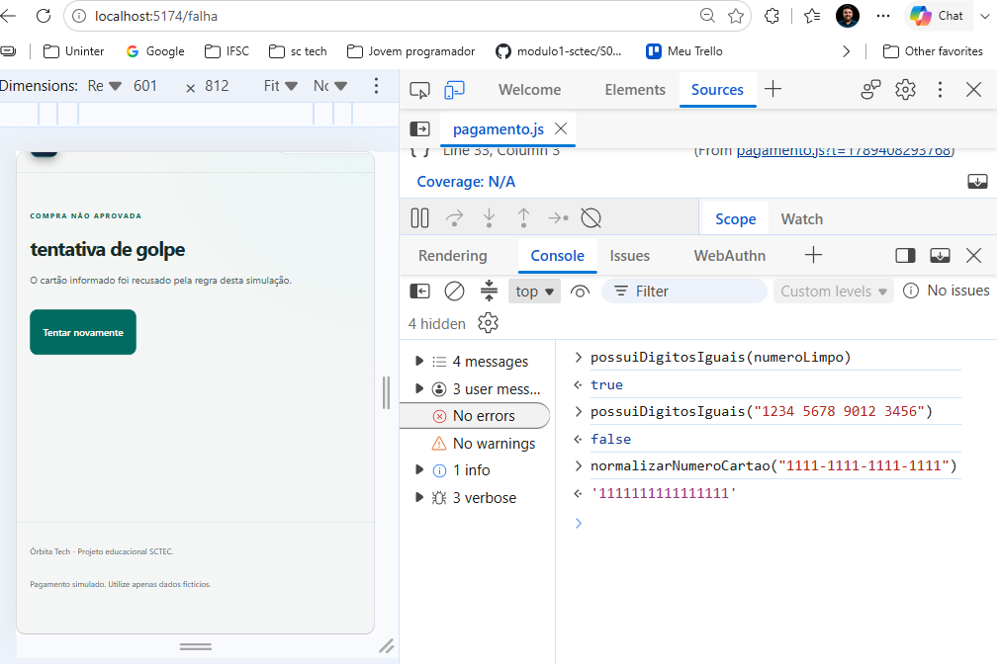

# Órbita Tech — Checkout React

Projeto individual desenvolvido para o Módulo 2, semana 7,
da formação Front-End React do SCTEC.

## Objetivo

Simular a finalização de uma compra em uma loja de acessórios
de tecnologia, desde a conferência do carrinho até o resultado
do pagamento.

A aplicação funciona no navegador, sem backend ou integração
com serviços de pagamento. Os dados utilizados são fictícios.

## Funcionalidades

- Carrinho fixo com dez produtos diferentes e doze unidades.
- Imagens ilustrativas, preços unitários, quantidades e subtotais.
- Total calculado a partir dos produtos e formatado em reais.
- Navegação entre carrinho, pagamento, sucesso e falha.
- Formulário com validação e mensagens por campo.
- Processamento assíncrono com feedback e bloqueio de novos envios.
- Interface adaptável a celular e computador.

## Tecnologias

- React, JavaScript e JSX.
- CSS.
- Vite e ESLint.
- React Router.
- React Hook Form e Zod.
- Git, GitHub e Trello.

## Como executar

Ambiente utilizado: Node.js 24.15.0 e npm 11.12.1.

```sh
git clone https://github.com/alexandredevsc/checkout-react.git
cd checkout-react
npm install
npm run dev
```

Abra o endereço informado pelo terminal.

Para analisar o código e gerar a versão de produção:

```sh
npm run lint
npm run build
```

Para visualizar localmente a versão compilada:

```sh
npm run preview
```

## Rotas

| Caminho | Página |
|---|---|
| `/` | Carrinho |
| `/pagamento` | Formulário de pagamento |
| `/sucesso` | Confirmação da compra |
| `/falha` | Recusa pela regra da simulação |

Endereços inexistentes apresentam uma página com retorno ao carrinho.

## Regras de pagamento

O formulário exige:

- Titular preenchido, desconsiderando espaços nas extremidades.
- Cartão com exatamente 16 dígitos, ignorando espaços e hífens.
- Validade no formato MM/AA, com mês entre 01 e 12.
- CVV com exatamente três dígitos.

Não são verificadas bandeira, validade futura ou algoritmo de Luhn,
conforme o escopo do enunciado.

Após validar o formato, a aplicação simula uma espera de 1,5 segundo.
Se todos os dígitos do cartão forem iguais, navega para a falha
e exibe "tentativa de golpe". Os demais números válidos são aprovados.

Os dados do cartão não são persistidos nem enviados a um servidor.

## Organização do código

- `src/pages`: páginas do fluxo.
- `src/components`: componentes ItemCarrinho e ResumoCompra.
- `src/data/produtos.js`: dados do carrinho fixo.
- `src/utils/carrinho.js`: cálculos em centavos e formatação monetária.
- `src/utils/pagamento.js`: validação e regra dos dígitos repetidos.
- `src/hooks/usePagamento.js`: estado e processamento da simulação.
- `public/images/produtos`: imagens locais dos acessórios.
- `docs`: evidências da investigação com debugger.

ItemCarrinho recebe um produto por props e é renderizado com map
e key estável. ResumoCompra recebe total e quantidade por props
e é reutilizado no carrinho e no pagamento.

## Planejamento e versionamento

As tarefas estão organizadas no
[Trello do projeto](https://trello.com/b/gh12JKpj/checkout-react-projeto-sctec).

O desenvolvimento utiliza branches por tarefa, criadas a partir
da develop. As alterações são integradas por pull requests,
preservando as branches.

Branches utilizadas:

- `feature/planejamento`
- `feature/estrutura-visual`
- `feature/modelagem-carrinho`
- `feature/componentes-carrinho`
- `feature/tema-claro`
- `feature/rotas-checkout`
- `feature/pagamento`
- `feature/revisao-entrega`

A develop concentra a integração. A main é destinada à entrega final.

## Verificações realizadas

- ESLint e build executados sem erros reportados.
- Subtotal do mouse: R$ 259,80.
- Total dos dez produtos: R$ 2.138,80.
- Array vazio retorna total zero.
- Formatação monetária verificada no Node.js.
- Formulário vazio e formatos inválidos apresentam erros.
- Cartão válido leva ao sucesso.
- Cartão com dígitos repetidos leva à falha.
- Mensagem de processamento e botão desabilitado conferidos.
- Carrinho e formulário inspecionados em 375 × 812.
- Foco no titular observado após envio inválido.

Durante a revisão mobile, foi corrigido o cálculo de largura
dos elementos com box-sizing: border-box, evitando que
preenchimentos e bordas aumentassem a largura prevista.

## Imagens e apoio de IA

As imagens dos acessórios são ilustrativas, geradas com IA
para representar produtos fictícios.

Foi utilizado apoio de IA no planejamento, nas explicações,
na elaboração de trechos de código e na revisão.
Executei os comandos, adaptei os arquivos e conferi os resultados
no navegador, no terminal e no debugger.

## Melhorias futuras

- Adicionar uma ilustração interativa de cartão com efeito 3D.
- Automatizar os testes das regras de negócio.
- Refinar a identidade visual e as imagens ilustrativas.

Catálogo editável, filtros e pagamento real não fazem parte
do escopo implementado.

## Vídeo de apresentação

Pendente de gravação e inclusão do link antes da entrega.

## Investigação com debugger

Investiguei como a aplicação identifica cartões com todos os
dígitos iguais.

No DevTools, na aba Sources, coloquei um breakpoint na linha de
retorno da função possuiDigitosIguais, em src/utils/pagamento.js.
Depois enviei o formulário com um cartão de 16 dígitos iguais.

Com a execução pausada, observei numeroLimpo no painel Scope
e conferi a sequência de chamadas em Call Stack.

No Console, executei estas verificações:

- possuiDigitosIguais(numeroLimpo): retornou true.
- possuiDigitosIguais("1234 5678 9012 3456"): retornou false.
- normalizarNumeroCartao("1111-1111-1111-1111"):
  retornou "1111111111111111".

Ao retomar a execução, a aplicação navegou para /falha e exibiu
"tentativa de golpe".

A investigação confirmou a identificação dos dígitos repetidos,
a remoção dos separadores e a navegação para o resultado de falha.



